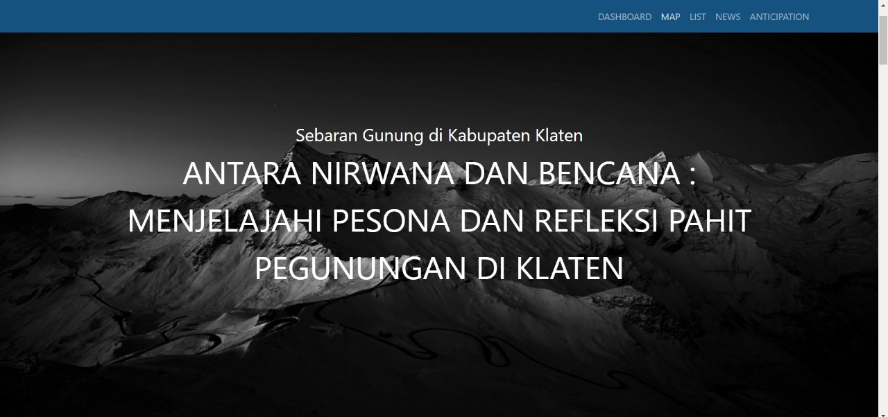
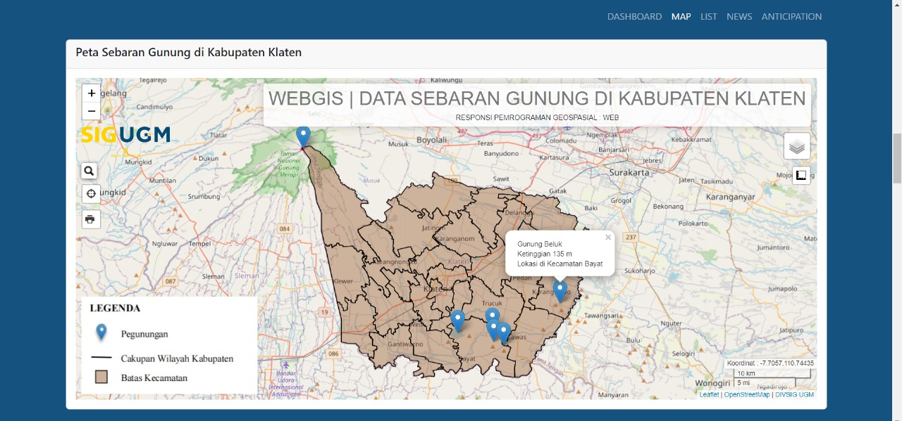

# pgweb-responzee

<h2>ANTARA NIRWANA DAN BENCANA :
 MENJELAJAHI PESONA DAN REFLEKSI PAHIT PEGUNUNGAN DI KABUPATEN KLATEN </h2>

WebGIS yang memaparkan pesona memukau dari objek alami Pegunungan serta refleksi pahit dampak bencana yang ditimbulkan dari aktivitas Pegunungan itu sendiri. Pegunungan sebagai salah satu keindahan alam yang sering dijumpai di Indonesia serta keindahannya menjadi daya tarik tersendiri. Objek yang disorot kali ini meliputi wilayah Kabupaten Klaten yang terletak di antara 110° 18′ 00″ dan 110° 45′ 00″ Bujur Timur, serta 7° 36′ 00″ dan 7° 48′ 00″ Lintang Selatan.

HTML | CSS | Bootsrap | Leaflet.JS | GeoJSON | phpmyadmin

Sumber Data :
1. Data GeoJSON : https://geoportal.klaten.go.id/
2. Data Kependudukan : https://klatenkab.bps.go.id/

<h3>Landing Page & Main Page</h3>

